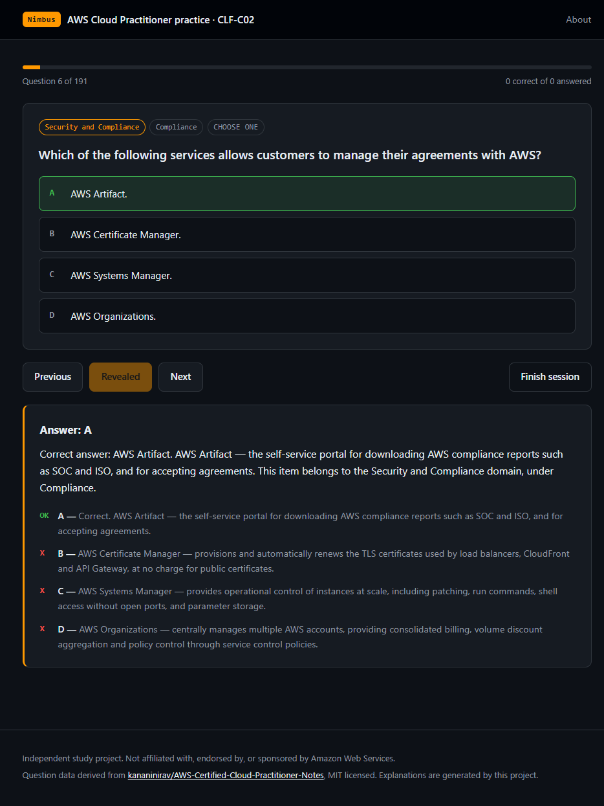

<div align="center">


# Nimbus

<a href="https://github.com/mehedi-hasan-2426/aws-ccp-trainer">
  
</a>

**A practice trainer for the AWS Certified Cloud Practitioner exam (CLF-C02)**
that tells you *why* each option is right or wrong.

### [Try it live at ccp.mehedihasanrahib.de](https://ccp.mehedihasanrahib.de)

[](https://github.com/mehedi-hasan-2426/aws-ccp-trainer/actions/workflows/ci.yml)
[](LICENSE)


[](docs/threat-model.md)



</div>

## Contents

- [Why this exists](#why-this-exists)
- [Quick start](#quick-start)
- [Features](#features)
- [How the question bank is built](#how-the-question-bank-is-built)
- [Project structure](#project-structure)
- [Deploying](#deploying)
- [Security](#security)
- [Contributing](#contributing)
- [Licence](#licence)

## Why this exists

Most practice dumps tell you the answer is B. They rarely tell you what A, C and D
actually were, which is where the learning is — the CLF-C02 exam is largely a test of
whether you can tell similar AWS services apart.

Nimbus attaches a definition to every option. Miss a question about AWS Artifact and
you also find out that Certificate Manager renews TLS certificates, Systems Manager
patches instances, and Organizations handles multi-account billing. One wrong answer
teaches you four services.

## Quick start

The site is live at **[ccp.mehedihasanrahib.de](https://ccp.mehedihasanrahib.de)**. To run
it yourself:

```sh
git clone https://github.com/mehedi-hasan-2426/aws-ccp-trainer.git
cd aws-ccp-trainer
npm run dev
```

```
Web Server is available at http://localhost:1313/
```

Nothing to install. The question bank is committed and there are no runtime
dependencies. You need [Hugo extended](https://gohugo.io/installation/) 0.146+ and
Node 20+.

## Features

|  | |
| --- | --- |
| **987 questions** | Across all four CLF-C02 domains, weighted as the real exam is |
| **Every option explained** | Not just the correct one, so a wrong guess still teaches you something |
| **Two modes** | Study with instant feedback, or a scored 65-question exam simulation |
| **Domain filtering** | Drill one weak area, with per-domain accuracy reported at the end |
| **Review incorrect** | Replays only what you missed |
| **Keyboard driven** | `A`-`E` or `1`-`5` to answer, arrows to move, `Enter` to reveal |
| **21 KB first paint** | Domain files load on demand behind a 0.7 KB index |
| **Zero dependencies** | No runtime packages, strict CSP, no inline script or style |

## How the question bank is built

The bank is generated, not hand-maintained.

```sh
npm run import
```

This fetches [kananinirav/AWS-Certified-Cloud-Practitioner-Notes][upstream] at a pinned
commit, parses the 23 practice exam files, drops duplicates and malformed entries, then
enriches what remains:

- options are matched against a glossary of AWS services and cloud concepts to attach a
  definition
- each question is assigned a domain and topic from the prompt first, so distractors
  cannot skew the classification
- negatively worded questions ("which is NOT...") are explained in reverse
- a definition is written once per question, so three distractors naming the same
  service do not repeat the same sentence
- explanations never cite option letters, because the app re-letters options at runtime

Upstream supplies answer keys but almost no written explanations. That layer is
generated here. To improve one, extend `tools/glossary.mjs` or `tools/descriptors.mjs`
and re-run the import.

## Project structure

```
assets/            css and js, bundled and fingerprinted by Hugo
content/           site pages
docs/              threat model, logo and screenshot
layouts/           Hugo templates
static/questions/  generated bank, one file per domain plus an index
tools/             import pipeline and security checks
.github/workflows/ CI
```

## Deploying

```sh
npm run build    # writes ./public
```

`vercel.json` carries the build command and security headers. Any static host works,
but the site runs under a Content Security Policy that allows no inline script or
style, so apply the equivalent headers wherever you deploy it.

## Security

```sh
npm test
```

Nine checks cover upstream pinning, CSP consistency, security headers, bank schema,
URL schemes, dependencies and secrets. Eight mutation tests then confirm each check
actually fails when violated, so the suite cannot rot into a no-op.

Both run in CI alongside CodeQL and secret scanning, with actions pinned by commit SHA.
See [SECURITY.md](SECURITY.md) for reporting and [docs/threat-model.md](docs/threat-model.md)
for the analysis.

## Contributing

Issues and pull requests are welcome. See [CONTRIBUTING.md](CONTRIBUTING.md) — the short
version is that `npm test` must pass, and question content is changed by editing the
glossary and re-running the import rather than by editing generated JSON.

## Licence

MIT, see [LICENSE](LICENSE). Question data from [kananinirav/AWS-Certified-Cloud-Practitioner-Notes][upstream]
(MIT), see [NOTICE](NOTICE). Upstream describes its sets as exam dumps, so treat them as
revision material. Not affiliated with AWS.

[upstream]: https://github.com/kananinirav/AWS-Certified-Cloud-Practitioner-Notes
