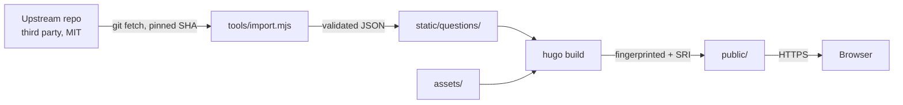

# Threat model

Covers the static site, the import pipeline and the generated question bank.
Method is STRIDE over the data flow below.

## Data flow

Trust boundaries: upstream to build machine (untrusted markdown), build machine to
host (published artefacts), host to browser (executed as script), page to
`localStorage` (preferences only).

There are no credentials, no personal data and no session tokens in the system. The
only stored value is a `localStorage` key holding domain and session preferences.

## Spoofing

Upstream is fetched over HTTPS from a fixed URL and pinned to commit `29b92fa`.
`sync()` re-reads `HEAD` after checkout and throws on mismatch, so a substituted or
redirected remote fails closed.

No user authentication exists, because there is nothing user-specific to protect.

## Tampering

Upstream content drift is the primary risk. The importer previously tracked `master`,
so any upstream edit reached the site unreviewed. It is now pinned to a commit SHA;
advancing it is a deliberate change with a reviewable diff.

Question text is rendered with `textContent` throughout, never `innerHTML`, and there
is no `eval` or template interpolation of data into markup. Reference URLs are
allowlisted by scheme at import and again in the browser before being assigned to an
`href`, since the data file is external input to the page.

Assets carry Subresource Integrity hashes and the build runs with
`--cleanDestinationDir`, so superseded bundles cannot be served after a deploy.

## Repudiation

Not applicable at runtime. Build provenance comes from git history and the upstream
commit recorded in `index.json`.

## Information disclosure

Nothing is collected. `Referrer-Policy: no-referrer` and `rel="noopener noreferrer"`
prevent leaking the page URL to outbound documentation links. Fetch and parse failures
surface a fixed generic message rather than the underlying error.

## Denial of service

The bank is split per domain behind a 0.7 KB index, so first paint is about 21 KB and
domain files load on demand. There is no origin compute to exhaust.

## Elevation of privilege

CSP is `default-src 'none'` with no `unsafe-inline` or `unsafe-eval`; `base-uri 'none'`
blocks base tag injection, `form-action 'none'` blocks exfiltration by form post, and
`frame-ancestors 'none'` plus `X-Frame-Options: DENY` block clickjacking.

The importer invokes `git` through `execFileSync` with fixed argument arrays, never a
shell string, so imported content cannot influence command construction.

There are no runtime dependencies. CI actions are pinned by commit SHA and the workflow
token is read-only by default.

## Residual risks

Upstream describes its sets as exam dumps of uncertain provenance. Accepted and
disclosed in `NOTICE`, the About page and the footer; this is a licensing and honesty
matter rather than a technical control.

Generated explanations are sometimes shallow. Accepted, and improved by extending
`tools/glossary.mjs`.

A pinned commit ages and misses upstream corrections. Accepted as the cost of not
letting a third party change the site unreviewed.

## Enforcement

`npm test` fails the build on any of these regressing:

| Check | Defends against |
| --- | --- |
| Upstream pinned to a 40 character SHA | Upstream drift |
| CSP present, no `unsafe-*`, matches deployed headers | Privilege escalation, config drift |
| Required security headers present | Clickjacking, sniffing |
| No inline script, style or event handlers | CSP bypass by regression |
| Bank passes schema validation | Malformed or hostile imported data |
| Reference URLs are `http`/`https` without credentials | Script-scheme injection |
| No runtime dependencies | Supply chain |
| No secret-shaped strings in source | Credential leakage |

`tools/verify-negative.mjs` mutates the repository to confirm each check actually
fails, so the suite cannot silently rot into a no-op.

Relevant controls: ISO 27001 A.8.25, A.8.26, A.8.28; NIST CSF PR.DS-6, PR.IP-2;
OWASP Top 10 A03, A05, A08.

Revisit when a backend, user input or runtime dependency is introduced, or when the
upstream pin is advanced.
